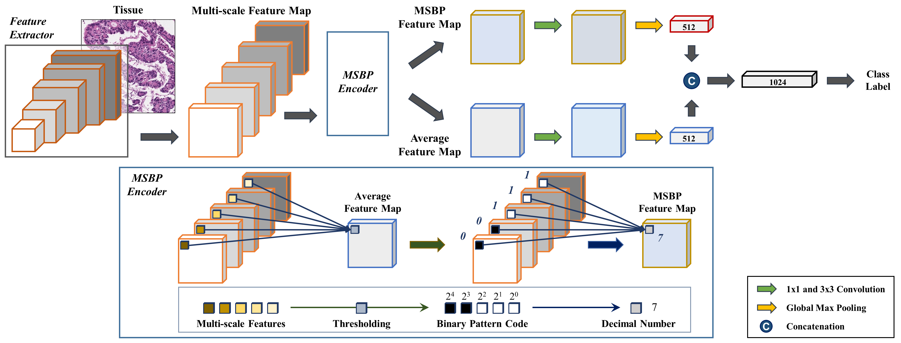

# MSBP-Net: Multi-scale binary pattern encoding network for cancer classification in pathology images
## About
A multi-scale approach identifies and leverages the patterns of the multiple scales within a deep neural network.
The patterns of the features across multiple scales are encoded as a binary pattern code and further converted to a decimal number, 
before embedded back to the classification model. <br />
[Link](https://ieeexplore.ieee.org/abstract/document/9496153) to J-BHI paper. <br />



All the models in this project were evaluated on the following datasets:

- [Colon_KBSMC](https://github.com/QuIIL/KBSMC_colon_cancer_grading_dataset) (Colon TMA from Kangbuk Samsung Hospital)
- [Colon_KBSMC](https://github.com/QuIIL/KBSMC_colon_cancer_grading_dataset) (Colon WSI from Kangbuk Samsung Hospital)
- [Prostate_KBSMC](https://github.com/QuIIL/KBSMC_colon_cancer_grading_dataset) (Colon WSI from Kangbuk Samsung Hospital)

## Set Up Environment

```
conda env create -f environment.yml
conda activate msbp_net
pip install torch~=1.8.1+cu111
```

Above, we install PyTorch version 1.8.1 with CUDA 11.1. 
The code still work older Pytorch version (PyTorch >=1.1).
## Repository Structure

Below are the main directories in the repository: 

- `dataset/`: the data loader and augmentation pipeline
- `docs/`: figures/GIFs used in the repo
- `model/`: model definition, along with the main run step and hyperparameter settings
- `prenet/`: model definition, along with the main run step and hyperparameter settings  
- `script/`: defines the training/infer loop 

Below are the main executable scripts in the repository:

- `config.py`: configuration file
- `dataset.py`: defines the dataset classes 
- `define_network.py`: defines the network 
- `trainer.py`: main training script
- `infer_produce_predict_map_wsi.py`: following sliding window fashion to generate a predicted map for WSI images 

# Running the Code

## Training and Options
 
```
  python trainer.py [--gpu=<id>] [--network_name=<network_name>] [--dataset=<colon/prostate>]
```

Options:
** Our proposed and other common/state-of-the-art multi-scale and single-scale methods, including:**

| METHOD         | run_info         |  Description          |
| ---------------|------------------| ----------------------|
| ResNet         | Resnet           | Feature extractor: ResNet50 (Code from Pytorch library)
| VGG            | VGG              | Feature extractor: VGG16 (Code from Pytorch library)
| MobileNetV1    | MobileNetV1      | Feature extractor: MobileNetV1 (Code from Pytorch library)
| EfficientNet   | EfficientNet     | Feature extractor: EfficientNetB1 (Code from lukemelas) [[Github]](https://github.com/lukemelas/EfficientNet-PyTorch)
| ResNeSt        | ResNeSt          | Feature extractor: ResNeSt50 (Code from Pytorch library)
| MuDeep         | MuDeep           | Multi_scale: Multi-scale deep learning architectures for person re-identification. [[paper]](https://arxiv.org/abs/1709.05165) [[code]](https://github.com/linzhi123/deep-persion-reid)
| MSDNet         | MSDNet           | Multi_scale: Multi-scale dense networks for resource efficient image classification. [[paper]](https://arxiv.org/abs/1703.09844) [[code]](https://github.com/kalviny/MSDNet-PyTorch)
| Res2Net        | Res2Net          | Multi_scale: Res2Net: A New Multi-scale Backbone Architecture [[paper]](https://arxiv.org/abs/1904.01169) [[code]](https://github.com/Res2Net/Res2Net-ImageNet-Training)
| FFN_concat     | ResNet_concat    | Multi_scale: Concat(multi_scale features)
| FFN_add        | ResNet_add       | Multi_scale: Add(multi_scale features)
| FFN_conv       | ResNet_conv      | Multi_scale: Conv(multi_scale features)
| FFN_concat(z−µ)| ResNet_concat_zm | Multi_scale: Concat(multi_scale features - mean(multi_scale features))
| FFN_conv(z−µ)  | ResNet_conv_zm   | Multi_scale: Conv(multi_scale features - mean(multi_scale features))
| MSBP-Net       | ResNet_MSBP      | Multi_scale: Binary Pattern encoding layer (Ours)


## Inference

```
  python infer_produce_predict_map_wsi.py [--gpu=<id>] [--network_name=<network_name>]
```
  
### Model Weights

Model weights obtained from training MSBP here:
- [Colon checkpoint](https://drive.google.com/drive/folders/129euzr7hZ3x99JaaSn6gWMdfdJiCbFC4?usp=drive_link)
- [Prostate checkpoint](https://drive.google.com/drive/folders/1Hbbx2pUXcgEPnTvJoIcpXZ7BSaXQ7oWI?usp=drive_link)

%Access the entire checkpoints [here](https://drive.google.com/drive/folders/1gX5NELGelZxLuqwcW9ptL5kDtf5-Gqcz?usp=sharing).

If any of the above checkpoints are used, please ensure to cite the corresponding paper.

## Authors

* [Trinh, TL Vuong](https://github.com/timmyvg), Song, Boram and Kim, Kyungeun and Cho, Yong M. and Jin Tae Kwak


## Citation

If any part of this code is used, please give appropriate citation to our paper. <br />

BibTex entry: <br />
```
@ARTICLE{9496153,
  author={Vuong, Trinh T. L. and Song, Boram and Kim, Kyungeun and Cho, Yong M. and Kwak, Jin T.},
  journal={IEEE Journal of Biomedical and Health Informatics}, 
  title={Multi-Scale Binary Pattern Encoding Network for Cancer Classification in Pathology Images}, 
  year={2022},
  volume={26},
  number={3},
  pages={1152-1163},
  doi={10.1109/JBHI.2021.3099817}}
```
